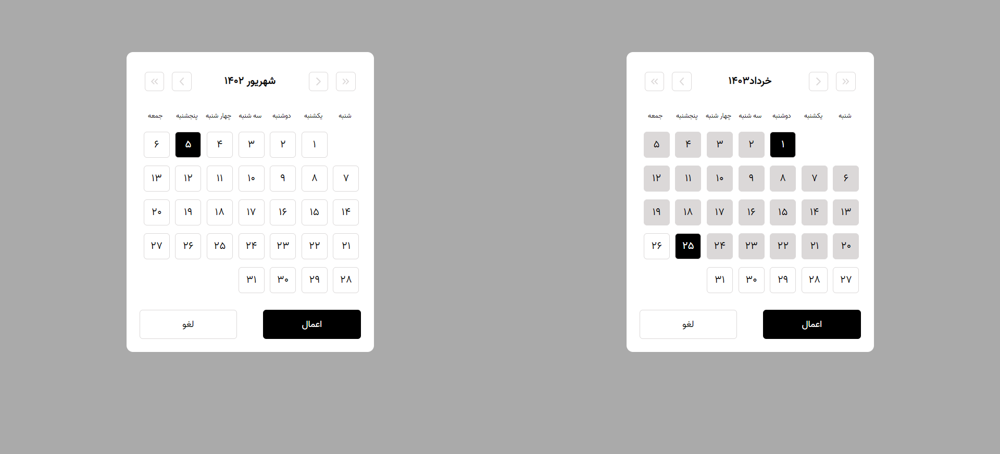

# rn-persian-date-picker-react

This is a package that includes two components: `DatePicker` and `RangeDatePicker`.

## Installation

To install this package, run the following command:

```javascript
npm install rn-persian-date-picker-react
``````

## get started

```javascript
import { DatePicker, RangeDatePicker } from 'rn-persian-date-picker-react';
``````
and import global.css in top of entry file :
```javascript
import 'rn-persian-date-picker-react/dist/global.css'
``````
## Props
### DatePicker :
The DatePicker component allows you to select a single date. It accepts the following props:

1-default_value: The default date value to be displayed. It should be an object with year, month, and day properties.

2-callback: A callback function that will be called when a date is selected. It will receive the selected date as an argument.
if cancel button press it will call with undefined argument
```javascript
<DatePicker
  default_value={{ year: 1402, month: 6, day: 5 }}
  callback={(selectedDate) => {
    console.log(selectedDate);
  }}
/>
``````


### RangeDatePicker :
The RangeDatePicker component allows you to select a range of dates. It accepts the following props:


1-start_default_value: The default start date value to be displayed. It should be an object with year, month, and day properties.


2-end_default_value: The default end date value to be displayed. It should be an object with year, month, and day properties.


3-A callback function that will be called when a range of dates is selected. It will receive an object with start and end properties representing the selected start and end dates.
if cancel button press it will call with undefined arguments

```javascript
<RangeDatePicker
  start_default_value={{ year: 1403, month: 3, day: 21 }}
  end_default_value={{ year: 1403, month: 5, day: 3 }}
  callback={(selectedRange) => {
    console.log(selectedRange.start, selectedRange.end);
  }}
/>
``````